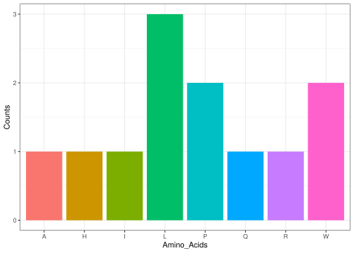
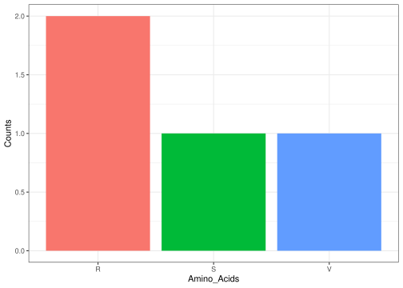

<!-- README.md is generated from README.Rmd. Please edit that file -->

# Replica

<!-- badges: start -->
<!-- badges: end -->

The goal of Replica is to …

## Installation

You can install the development version of Replica from
[GitHub](https://github.com/) with:

``` r
# install.packages("pak")
pak::pak("rforbiodatascience25/group_23_package")
```

## Example

This is a basic example which shows you how to solve a common problem:

``` r
library(Replica)
## basic example code
```

This package is all about replicating the central dogma of molecular
biology. It is composed of 5 functions.

The first function creates a DNA sequence from a string of nucleotides.
To do so, it takes as input an integer to indicate the number of
nucleotides used, which is going to be the final lenght of the DNA
sequence. For instance:

``` r
sequence_lenght <- 12
build_dna(sequence_lenght)
#> [1] "GTGCAAACTTCA"
```

The second function is about transcription: it takes a DNA sequence as
input and turns it into a RNA sequence by converting all the Thymine
into Uracil. For instance:

``` r
transcription('ACACGTAGTTA')
#> [1] "ACACGUAGUUA"
```

The third function aims to convert a RNA sequence into codons. Thus, it
takes as inputs the RNA sequence to convert and the first position from
where it’ll start making the codons. For instance:

``` r
make_codons("AUGCGAUGC", start = 1)
#> [1] "AUG" "CGA" "UGC"
```

The fourth function translates the RNA codons into the corresponding
amino acids chain. Hence, the input is the codons sequence to translate.
For instance:

``` r
codons <- c("AUG", "CCU","CAA", "CGA", "UGG", "GGC")
translation(codons)
#> [1] "MPQRWG"
```

Lastly, the fifth function aims to plot the frequency of each amino acid
into a sequence of amino acids. To do so, it takes the sequence of amino
acids as an input. For instance:

``` r
options(bitmapType = "cairo")

aa_chain <- "AWLPPHWLLQRI"
plot <- aa_frequency_plot(aa_chain)  # create ggplot
print(plot)  # actually draw it to the PNG device
```



These five function can thus be used to replicate the whole process of
DNA transcription/translation and find the frequency of each resulting
amino acid in the resulting sequence as so:

``` r
library(Replica)
options(bitmapType = "cairo")

# Creating the DNA sequence
sequence_lenght <- 12
dna <- build_dna(sequence_lenght)

# Turning it into a RNA sequence
rna <- transcription(dna)

# Making the codons out of it
codons <- make_codons(rna, start = 1)

# Translating the codons into amino acids chain
aa_chain <- translation(codons)

# Ploting the frequency of each amino acid in this resulting sequence
aa_plot <- aa_frequency_plot(aa_chain)
aa_plot
```



These functions can be used to create dummy cases and generate random
amino acids chains, but it can also be used on actual data (starting
from DNA, RNA, or even a list of codon) to do the following steps. An
improvement of the package could be to add a reverse strand DNA function
or a transcription function.
